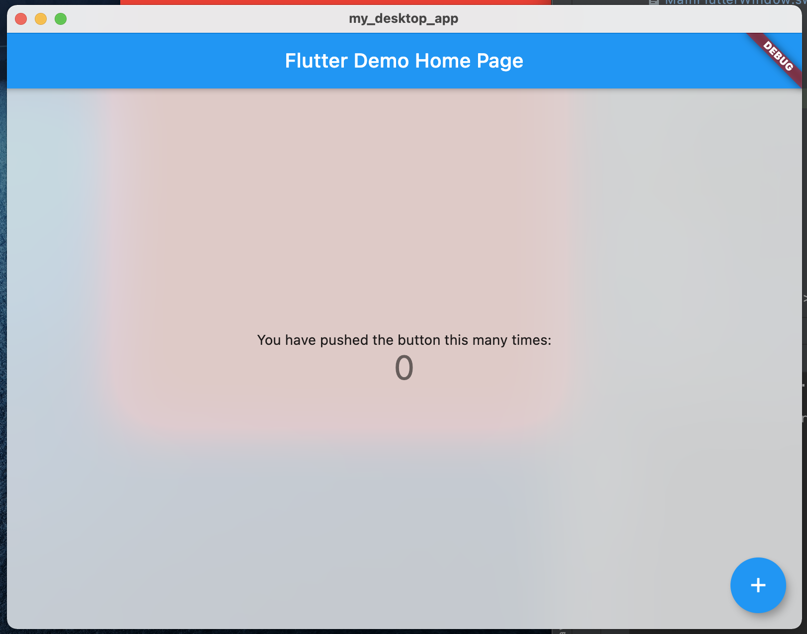
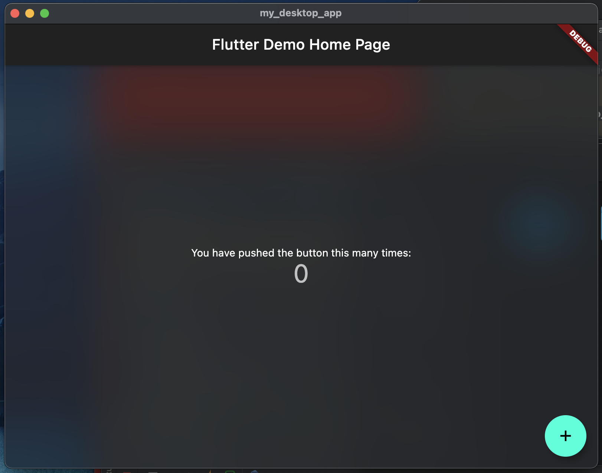

# my_desktop_app

An example of desktop application on Flutter

[https://medium.com/litslink/flutter-desktop-application-tutorial-3493385e31f3](https://medium.com/litslink/flutter-desktop-application-tutorial-3493385e31f3)

| PREVIEW LIGHT | PREVIEW DARK |
|:-:|:-:|
|||
